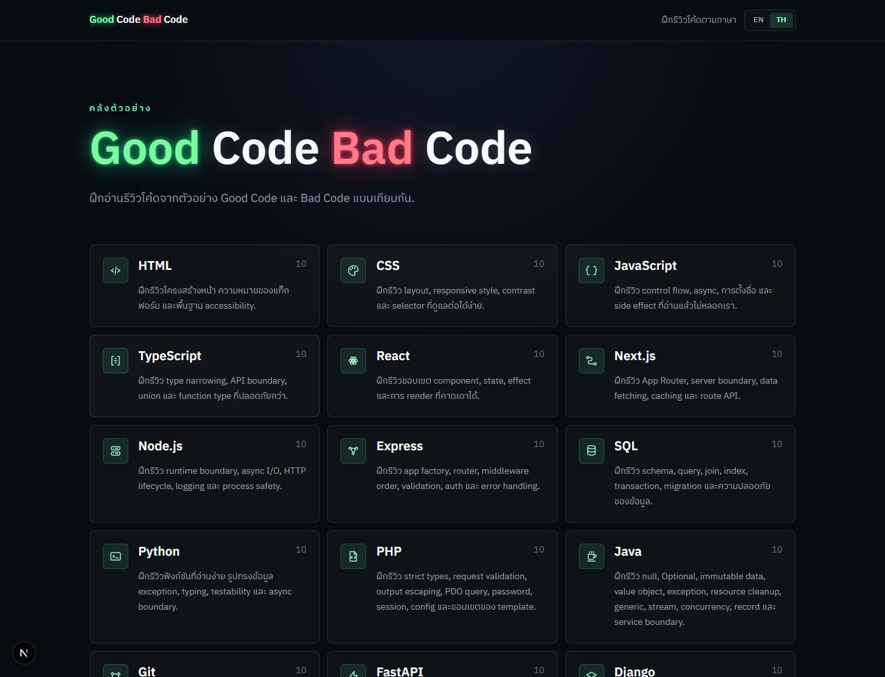
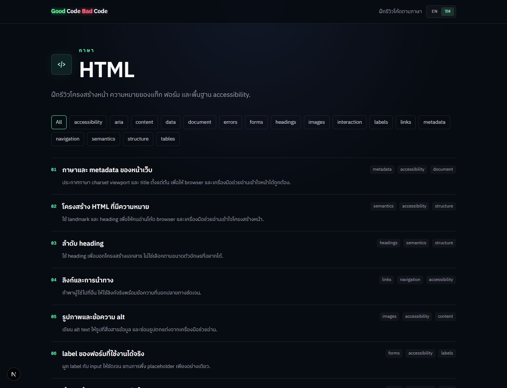
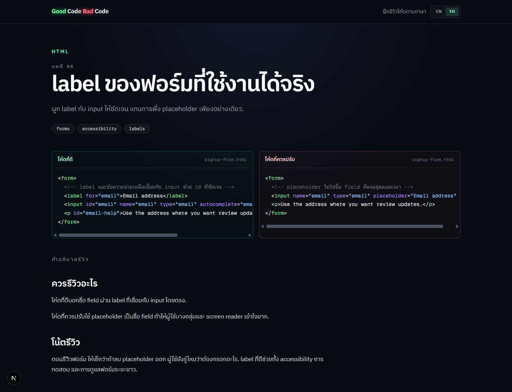

# Good Code Bad Code

Good Code Bad Code is a read-only learning library for developers who want to improve their code review instincts by comparing side-by-side examples.

Each lesson shows a focused **Good Code** sample next to a **Bad Code** sample, then explains what to review, why the issue matters, and what habit to carry into future reviews.

## Why This Exists

Most code review advice is abstract: "write clean code", "avoid side effects", "prefer good naming". This project makes those ideas visible through small, realistic examples that readers can inspect by themselves.

The first version is an **Example Library**, not a quiz platform or interactive grader. Bad Code can still run; it exists to make a review issue easier to spot.

## Screenshots

Home page:



Track page:



Lesson page:



## Features

- Side-by-side Good Code and Bad Code comparisons
- 18 tracks with 10 lessons per track
- Lessons for languages, frameworks, runtimes, tools, and styling systems
- English and Thai lesson copy
- Thai-translated code comments for supported lesson sweeps
- Syntax highlighting with Shiki
- Previous and next lesson navigation
- SEO metadata, sitemap, robots.txt, and Open Graph image
- Static export ready for Cloudflare Pages
- Support footer with Buy Me a Coffee

## Tracks

Current tracks:

- HTML
- CSS
- JavaScript
- TypeScript
- React
- Next.js
- Node.js
- Express
- SQL
- Python
- PHP
- Java
- Git
- FastAPI
- Django
- Go
- Docker
- Tailwind CSS

## Tech Stack

- Next.js 16 App Router
- React 19
- TypeScript
- Tailwind CSS 4
- MDX
- Shiki
- Node test runner

## Getting Started

Install dependencies:

```bash
npm install
```

Run the development server:

```bash
npm run dev
```

Open:

```txt
http://localhost:3000
```

## Scripts

```bash
npm run dev
npm run build
npm run lint
npm run test:content
```

`npm run build` creates a static export because `next.config.ts` uses:

```ts
output: "export"
```

The static output is written to `out/`.

## Project Structure

```txt
app/                     App Router routes, metadata routes, layout
components/              UI components for home, tracks, lessons, language, footer
content/                 MDX lessons organized by track
content/lesson-registry.ts
lib/content/             Lesson loading, navigation, schema, code comment helpers
lib/i18n/                Language state and Thai translations
lib/seo.ts               Shared SEO, canonical URL, sitemap helpers
public/                  Icons, favicon assets, support logo
tests/content/           Content, registry, i18n, SEO, icon, and UI contract tests
docs/content-guidelines.md
CONTEXT.md
```

## Content Model

A Review Lesson belongs to one Track and includes:

- Title, order, summary, tags, and takeaways
- Good Code sample
- Bad Code sample
- Review notes written in MDX
- Thai localized copy in `lib/i18n/translations.ts`
- Optional Thai code comment translations matched to the English comment order

When adding or editing lessons, read:

- `CONTEXT.md` for project vocabulary
- `docs/content-guidelines.md` for lesson, code comment, and Thai copy guidelines

## Adding A Lesson

1. Add the MDX file under `content/<track>/`.
2. Export `metadata` with `track`, `order`, `summary`, `tags`, `takeaways`, `goodCode`, and `badCode`.
3. Register the lesson in `content/lesson-registry.ts`.
4. Add Thai copy in `lib/i18n/translations.ts`.
5. Run:

```bash
npm run test:content
```

The content tests check lesson counts, contiguous ordering, MDX compilation, translation coverage, code comment coverage, SEO helpers, icons, and shared UI contracts.

## Deployment

The project is configured for static hosting.

Recommended Cloudflare Pages settings:

```txt
Framework preset: Next.js (Static HTML Export)
Production branch: main
Build command: npm run build
Build output directory: out
Root directory: /
```

Set this environment variable in production:

```txt
NEXT_PUBLIC_SITE_URL=https://your-domain.com
```

This controls canonical URLs, sitemap URLs, robots.txt, and Open Graph image URLs.

## SEO And Social Sharing

The app includes:

- `metadataBase`
- title templates
- canonical URLs
- Open Graph metadata
- Twitter card metadata
- generated `/sitemap.xml`
- generated `/robots.txt`
- generated `/opengraph-image`
- favicon and web manifest assets

## Support

If the project helps you, you can support the creator here:

[Buy Me a Coffee](https://buymeacoffee.com/milerdev)

## Development Notes

- Keep content changes focused by track when possible.
- Commit completed track sweeps separately.
- Prefer clear review signals over long explanations inside code comments.
- Keep Thai copy natural for Thai developers; do not force literal translations for common technical terms.
